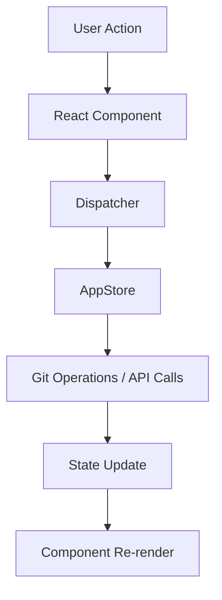

GitHub Desktop is an open-source [Electron](https://www.electronjs.org/)-based application written in [TypeScript](https://www.typescriptlang.org) using [React](https://reactjs.org/) for the UI layer.

## Core Architecture

GitHub Desktop follows a layered architecture pattern that separates concerns across different modules:

<CardGroup cols={2}>
  <Card title="Electron Layer" icon="window">
    Main and renderer processes handling OS integration and window management
  </Card>
  <Card title="UI Layer" icon="browser">
    React components and views for user interactions
  </Card>
  <Card title="Business Logic" icon="gears">
    Stores, state management, and application orchestration
  </Card>
  <Card title="Git Operations" icon="code-branch">
    Low-level Git operations using dugite wrapper
  </Card>
</CardGroup>

## Project Structure

The application code is organized under `app/src/` with the following key directories:

### Main Directories

```
app/src/
├── main-process/     # Electron main process code
├── ui/               # React components and views
├── lib/              # Core business logic and utilities
│   ├── git/         # Git operations layer
│   ├── stores/      # State management stores
│   └── api.ts       # GitHub API integration
├── models/           # TypeScript models and types
└── crash/            # Crash reporting UI
```

### Key Components

<Info>
  The application uses **57+ Git operation modules** in `app/src/lib/git/` providing comprehensive Git functionality.
</Info>

#### Main Process (`app/src/main-process/`)
- **main.ts**: Application entry point, window lifecycle management
- **app-window.ts**: Main application window management
- **menu/**: Application menu and context menu builders
- **ipc-main.ts**: Inter-process communication handlers

#### UI Layer (`app/src/ui/`)
- **app.tsx**: Root React component (~80+ sub-directories)
- **dispatcher/**: Central event dispatcher for UI actions
- **lib/**: Reusable UI components and utilities
- Feature-specific components (branches, commits, diff, history, etc.)

#### Business Logic (`app/src/lib/`)
- **app-state.ts**: Central application state interface
- **stores/**: State management stores
- **git/**: Git operation wrappers
- **api.ts**: GitHub REST API client

## Data Flow



### Flow Description

1. **User Interaction**: User performs an action in the UI
2. **Component Handler**: React component captures the event
3. **Dispatcher**: Action is dispatched through the central `Dispatcher` class
4. **Store Processing**: `AppStore` processes the action and coordinates with other stores
5. **Operations**: Git operations or API calls are executed
6. **State Update**: Application state is updated
7. **Re-render**: React components re-render with new state

<Note>
  The Dispatcher pattern provides a clear separation between UI and business logic, making the codebase maintainable and testable.
</Note>

## Key Technologies

<CardGroup cols={2}>
  <Card title="Electron" icon="window">
    Cross-platform desktop framework (macOS, Windows)
  </Card>
  <Card title="React 16.8+" icon="react">
    UI library with hooks support
  </Card>
  <Card title="TypeScript" icon="code">
    Type-safe JavaScript with strict mode
  </Card>
  <Card title="dugite" icon="git-alt">
    Embedded Git distribution wrapper
  </Card>
  <Card title="Dexie.js" icon="database">
    IndexedDB wrapper for local data storage
  </Card>
  <Card title="CodeMirror" icon="file-code">
    Text editor for diff viewing
  </Card>
</CardGroup>

## State Management

GitHub Desktop uses a custom store-based architecture:

- **AppStore** (~8,700 lines): Central store coordinating all application state
- **GitStore**: Per-repository Git state (branches, commits, status)
- **RepositoriesStore**: Repository list and metadata
- **AccountsStore**: User accounts and authentication
- **PullRequestStore**: Pull request data and status
- **CommitStatusStore**: CI/CD check status

<Info>
  Stores emit events when state changes, allowing React components to subscribe and update automatically.
</Info>

## Build System

The application uses webpack for bundling:

- **webpack.common.ts**: Shared configuration
- **webpack.development.ts**: Development mode with hot reload
- **webpack.production.ts**: Production builds with optimization

### Build Outputs

- **main.js**: Electron main process bundle
- **renderer.js**: UI renderer process bundle
- **styles/**: Compiled SCSS styles

## Cross-Platform Considerations

The codebase handles platform-specific behavior:

- **macOS**: Native menu integration, dock icon updates
- **Windows**: Squirrel updater, Windows-specific paths
- Platform detection via `getOS()` utility
- Shell integration (Terminal, Command Prompt, PowerShell)

## Performance Optimizations

<CardGroup cols={2}>
  <Card title="Virtualized Lists" icon="list">
    Using react-virtualized for large lists (repos, commits, changes)
  </Card>
  <Card title="Memoization" icon="memory">
    memoize-one for expensive computations
  </Card>
  <Card title="Lazy Loading" icon="bolt">
    On-demand loading of repository data
  </Card>
  <Card title="Background Tasks" icon="clock">
    Non-blocking Git operations for large repos
  </Card>
</CardGroup>

## Error Handling

Comprehensive error handling throughout:

- **exception-reporting.ts**: Crash and error reporting
- **show-uncaught-exception.ts**: Unhandled exception UI
- **Error handlers** in Dispatcher for graceful degradation
- Git error parsing and user-friendly messages

## Next Steps

<CardGroup cols={2}>
  <Card title="Electron Structure" href="/architecture/electron-structure">
    Deep dive into main and renderer processes
  </Card>
  <Card title="UI Components" href="/architecture/ui-components">
    Explore React component architecture
  </Card>
  <Card title="Git Operations" href="/architecture/git-operations">
    Learn about the Git layer
  </Card>
  <Card title="State Management" href="/architecture/state-management">
    Understand stores and data flow
  </Card>
</CardGroup>