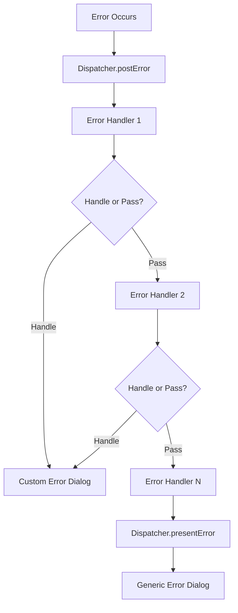

## Overview

GitHub Desktop distinguishes between two types of errors:

- **Exceptions**: Unexpected, fatal problems requiring app restart
- **Errors**: Expected runtime issues that can be handled gracefully

<Info>
Both are represented by JavaScript's `Error` class, but they're conceptually different in how they're handled.
</Info>

## Exceptions

### Fatal Application Errors

An exception is an unexpected, fatal problem in the application itself that cannot be resolved at runtime.

Examples:
- `undefined is not a function`
- Uncaught type errors
- Null reference errors

### Global Exception Handler

GitHub Desktop registers a global listener for uncaught exceptions:

```typescript
// From app/src/ui/index.tsx:75
window.addEventListener('error', (event) => {
  // Report exception to error tracking
  reportException(event.error)
  
  // Notify user of unrecoverable error
  showFatalErrorDialog(event.error)
  
  // Quit and relaunch application
  app.relaunch()
  app.exit(1)
})
```

<Warning>
When an exception occurs, the only option is to quit and relaunch the application.
</Warning>

## Errors

### Expected Runtime Errors

Errors are issues that can occur during normal application usage:

- Network connectivity problems
- Git repository in unexpected state
- File system permission issues
- API rate limiting

### Error Flow Architecture



### Error Dispatcher

Errors flow through the `Dispatcher` like most application events:

```typescript
// From app/src/lib/dispatcher/dispatcher.ts:308
postError(error: Error) {
  // Run through registered error handlers (most recent first)
  for (const handler of this.errorHandlers.reverse()) {
    error = await handler(error, this)
    
    // Handler can swallow the error by returning null
    if (error === null) {
      return
    }
  }
  
  // If no handler dealt with it, show generic error dialog
  this.presentError(error)
}
```

### Error Handler Interface

Error handlers must have this signature:

```typescript
export async function myCoolErrorHandler(
  error: Error,
  dispatcher: Dispatcher
): Promise<Error | null> {
  // Inspect the error
  if (error instanceof SpecificError) {
    // Handle this specific error
    dispatcher.showCustomDialog(error)
    return null  // Swallow the error
  }
  
  // Pass through to next handler
  return error
}
```

<Steps>
  <Step title="Receive error and dispatcher">
    Handler gets the error object and dispatcher instance.
  </Step>
  
  <Step title="Inspect and handle">
    Check error type and handle if appropriate.
  </Step>
  
  <Step title="Return or swallow">
    Return the error (or a modified version) to pass along, or return `null` to stop propagation.
  </Step>
</Steps>

### Registering Error Handlers

```typescript
// From app/src/lib/dispatcher/dispatcher.ts:711
registerErrorHandler(handler: ErrorHandler) {
  this.errorHandlers.push(handler)
}
```

Handlers are invoked in reverse order (most recently registered first).

## Error Classes

### ErrorWithMetadata

From `app/src/lib/error-with-metadata.ts:23`:

```typescript
export interface IErrorMetadata {
  /** Was the action which caused this error part of a background task? */
  readonly backgroundTask?: boolean

  /** The repository from which this error originated. */
  readonly repository?: Repository | CloningRepository

  /** The action to retry if applicable. */
  readonly retryAction?: RetryAction

  /** Additional context that specific actions can provide fields for */
  readonly gitContext?: GitErrorContext
}

/** An error which contains additional metadata. */
export class ErrorWithMetadata extends Error {
  /** The error's metadata. */
  public readonly metadata: IErrorMetadata

  /** The underlying error to which the metadata is being attached. */
  public readonly underlyingError: Error

  public constructor(error: Error, metadata: IErrorMetadata) {
    super(error.message)

    this.name = error.name
    this.stack = error.stack
    this.underlyingError = error
    this.metadata = metadata
  }
}
```

### Usage Example

```typescript
import { ErrorWithMetadata } from '../lib/error-with-metadata'

try {
  await performGitOperation()
} catch (error) {
  throw new ErrorWithMetadata(error, {
    repository: this.repository,
    backgroundTask: true,
    retryAction: {
      type: RetryActionType.Push,
      repository: this.repository
    }
  })
}
```

### Retry Actions

The `retryAction` metadata allows error handlers to offer retry functionality:

```typescript
import { RetryAction, RetryActionType } from '../models/retry-actions'

const retryAction: RetryAction = {
  type: RetryActionType.Push,
  repository: repository,
  branch: currentBranch
}
```

Error dialogs can present a "Retry" button that re-executes the failed action.

### Git Error Context

The `gitContext` provides additional details about Git operations:

```typescript
import { GitErrorContext } from '../lib/git-error-context'

const gitContext: GitErrorContext = {
  kind: 'checkout',
  branchToCheckout: targetBranch
}
```

This helps error handlers provide specific guidance on recovery.

## Specialized Error Classes

### CheckoutError

From `app/src/lib/error-with-metadata.ts:44`:

```typescript
/**
 * An error thrown when a failure occurs while checking out a branch.
 * Technically just a convenience class on top of ErrorWithMetadata
 */
export class CheckoutError extends ErrorWithMetadata {
  public constructor(error: Error, repository: Repository, branch: Branch) {
    super(error, {
      gitContext: { kind: 'checkout', branchToCheckout: branch },
      retryAction: { type: RetryActionType.Checkout, branch, repository },
      repository,
    })
  }
}
```

Usage:

```typescript
try {
  await checkoutBranch(repository, branch)
} catch (error) {
  throw new CheckoutError(error, repository, branch)
}
```

### DiscardChangesError

From `app/src/lib/error-with-metadata.ts:58`:

```typescript
/**
 * An error thrown when a failure occurs while discarding changes to trash.
 * Technically just a convenience class on top of ErrorWithMetadata
 */
export class DiscardChangesError extends ErrorWithMetadata {
  public constructor(
    error: Error,
    repository: Repository,
    files: ReadonlyArray<WorkingDirectoryFileChange>
  ) {
    super(error, {
      retryAction: { type: RetryActionType.DiscardChanges, files, repository },
    })
  }
}
```

### CreateRepositoryError

From `app/src/lib/error-with-metadata.ts:70`:

```typescript
export class CreateRepositoryError extends ErrorWithMetadata {
  public constructor(error: Error) {
    super(error, {
      gitContext: { kind: 'create-repository' },
    })
  }
}
```

## GitError

Wraps raw errors from `dugite` (the Git wrapper) with additional Git-specific information:

```typescript
// From app/src/lib/git/core.ts:62
export class GitError extends Error {
  /** The result from the failed Git command */
  public readonly result: IGitResult
  
  /** The Git error code, if applicable */
  public readonly gitError?: DugiteError
  
  public constructor(result: IGitResult, args: ReadonlyArray<string>) {
    super(`Git command failed: ${args.join(' ')}`)
    this.name = 'GitError'
    this.result = result
    this.gitError = parseGitError(result.stderr)
  }
}
```

## Error Handler Examples

### Repository-Specific Handler

```typescript
export async function handleRepositoryError(
  error: Error,
  dispatcher: Dispatcher
): Promise<Error | null> {
  if (!(error instanceof ErrorWithMetadata)) {
    return error
  }
  
  const { repository } = error.metadata
  if (!repository) {
    return error
  }
  
  // Show repository-specific error dialog
  dispatcher.showRepositoryError(error, repository)
  return null
}
```

### Network Error Handler

```typescript
export async function handleNetworkError(
  error: Error,
  dispatcher: Dispatcher  
): Promise<Error | null> {
  if (error.message.includes('ECONNREFUSED')) {
    // Show "check your connection" message
    dispatcher.showNetworkError()
    return null
  }
  
  return error
}
```

### Git Conflict Handler

```typescript
export async function handleGitConflicts(
  error: Error,
  dispatcher: Dispatcher
): Promise<Error | null> {
  if (!(error instanceof GitError)) {
    return error
  }
  
  if (error.gitError === DugiteError.MergeConflicts) {
    // Show conflict resolution UI
    dispatcher.showConflictDialog()
    return null
  }
  
  return error
}
```

## Best Practices

### Creating Errors

<Steps>
  <Step title="Use specific error classes">
    Use `CheckoutError`, `DiscardChangesError`, etc. when appropriate.
  </Step>
  
  <Step title="Include metadata">
    Add repository, retry action, and git context information.
  </Step>
  
  <Step title="Preserve original error">
    Wrap rather than replace the original error.
  </Step>
</Steps>

```typescript
// Good
try {
  await gitOperation()
} catch (error) {
  throw new ErrorWithMetadata(error, {
    repository: this.repository,
    retryAction: { type: RetryActionType.Push, repository }
  })
}

// Bad  
try {
  await gitOperation()
} catch (error) {
  throw new Error('Git operation failed')  // Lost context!
}
```

### Error Messages

<Warning>
Make error messages user-friendly and actionable. Avoid technical jargon.
</Warning>

```typescript
// Good
"Could not push to the remote repository. Check your network connection."

// Bad
"Error: ECONNREFUSED 443"
```

### Error Handlers

```typescript
// Good: Specific and focused
export async function handlePushError(
  error: Error,
  dispatcher: Dispatcher
): Promise<Error | null> {
  if (error instanceof GitError && isPushError(error)) {
    // Handle push errors
    return null
  }
  return error
}

// Bad: Too broad
export async function handleAllErrors(
  error: Error,
  dispatcher: Dispatcher  
): Promise<Error | null> {
  // Show generic dialog for everything
  dispatcher.showError(error)
  return null  // Swallows all errors!
}
```

## Debugging Errors

### Logging

```typescript
export async function debugErrorHandler(
  error: Error,
  dispatcher: Dispatcher
): Promise<Error | null> {
  console.log('Error:', error)
  console.log('Stack:', error.stack)
  
  if (error instanceof ErrorWithMetadata) {
    console.log('Metadata:', error.metadata)
    console.log('Underlying:', error.underlyingError)
  }
  
  return error  // Pass to next handler
}
```

### Error Tracking

Errors reported to error tracking service include:

- Error message and stack trace
- Application version and platform
- User actions leading to error
- Repository state (sanitized)

### Testing Error Paths

```typescript
describe('error handling', () => {
  it('handles checkout errors', async () => {
    const error = new Error('checkout failed')
    const checkoutError = new CheckoutError(error, repository, branch)
    
    const result = await handleCheckoutError(checkoutError, dispatcher)
    
    expect(result).toBeNull()  // Error was handled
    expect(dispatcher.showDialog).toHaveBeenCalled()
  })
})
```