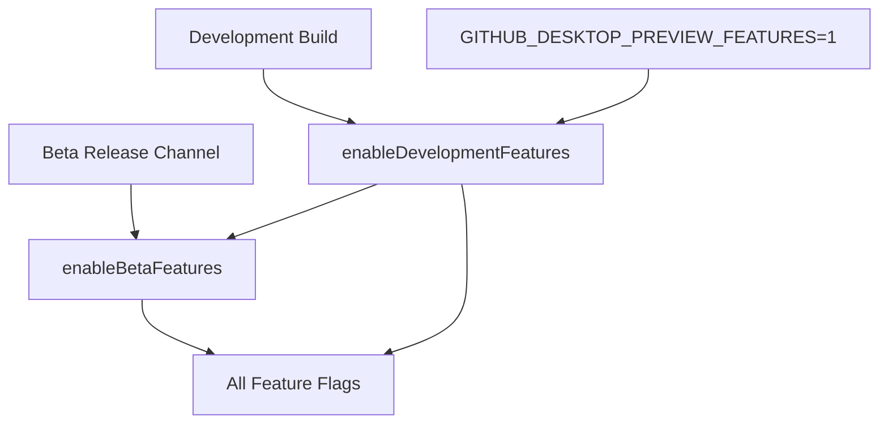

## Overview

GitHub Desktop uses feature flags to ship stable but not production-ready features. This system allows the team to deploy code without blocking on final design feedback while giving users the option to preview new functionality.

## Types of Features

### Preview Features

A **preview feature** is:

- Well-defined in scope
- Approved by team consensus to proceed
- Has details that need clarification or iteration

<Info>
Currently focused on UI changes: new views, significant changes to existing views, and similar interface modifications.
</Info>

### Beta Features

A **beta feature** is:

- Slated for an upcoming release
- Usably complete
- Needs more testing or real-world usage
- A superset of preview features

<Note>
Beta features include all preview features plus additional functionality ready for wider testing.
</Note>

## Why Use Feature Flags?

Benefits of feature flagging:

<Steps>
  <Step title="Faster iteration">
    Get working code shipped quickly without waiting for perfect solutions.
  </Step>
  
  <Step title="User feedback">
    Users can opt-in to preview features and provide early feedback.
  </Step>
  
  <Step title="Conservative evolution">
    Avoid unnecessary UI churn that frustrates users.
  </Step>
  
  <Step title="Easy rollback">
    Pull features before users get attached if they don't work out.
  </Step>
</Steps>

## Implementation

### Core Functions

From `app/src/lib/feature-flag.ts:10`:

```typescript
const Disable = false

/**
 * Enables the application to opt-in for preview features based on runtime
 * checks. This is backed by the GITHUB_DESKTOP_PREVIEW_FEATURES environment
 * variable, which is checked for non-development environments.
 */
function enableDevelopmentFeatures(): boolean {
  if (Disable) {
    return false
  }

  if (__DEV__) {
    return true
  }

  if (process.env.GITHUB_DESKTOP_PREVIEW_FEATURES === '1') {
    return true
  }

  return false
}

/** Should the app enable beta features? */
function enableBetaFeatures(): boolean {
  return enableDevelopmentFeatures() || __RELEASE_CHANNEL__ === 'beta'
}
```

### Feature Hierarchy



## Creating Feature Flags

### Step 1: Add Feature Flag Function

Add a new function to `app/src/lib/feature-flag.ts`:

```typescript
/** Should we show a pull-requests quick view? */
export function enablePullRequestQuickView(): boolean {
  return enableDevelopmentFeatures()
}
```

### Step 2: Use in Code

Check the feature flag at runtime to conditionally render features:

```typescript
import { enablePullRequestQuickView } from '../lib/feature-flag'

class MyComponent extends React.Component {
  render() {
    if (enablePullRequestQuickView()) {
      return <PullRequestQuickView />
    } else {
      return <StandardPullRequestView />
    }
  }
}
```

### Example: Pull Request Integration

<Info>
See [#3339](https://github.com/desktop/desktop/pull/3339) for a complete example of pull request integration using feature flags.
</Info>

## Example Feature Flags

### Development-Only Features

From `app/src/lib/feature-flag.ts:78`:

```typescript
/** Should we show a pull-requests quick view? */
export function enablePullRequestQuickView(): boolean {
  return enableDevelopmentFeatures()
}
```

Enabled when:
- Development build (`__DEV__ === true`), OR
- `GITHUB_DESKTOP_PREVIEW_FEATURES=1` environment variable set

### Beta Features

From `app/src/lib/feature-flag.ts:44`:

```typescript
export function enableReadmeOverwriteWarning(): boolean {
  return enableBetaFeatures()
}

/** Should the app detect Windows Subsystem for Linux as a valid shell? */
export function enableWSLDetection(): boolean {
  return enableBetaFeatures()
}
```

Enabled when:
- Development build, OR
- Preview features enabled, OR  
- Beta release channel

### Platform-Specific Flags

From `app/src/lib/feature-flag.ts:64`:

```typescript
/**
 * Should we allow x64 apps running under ARM translation to auto-update to
 * ARM64 builds?
 */
export function enableUpdateFromEmulatedX64ToARM64(): boolean {
  if (__DARWIN__) {
    return true  // Always enabled on macOS
  }

  return enableBetaFeatures()
}
```

### Account-Based Flags

From `app/src/lib/feature-flag.ts:91`:

```typescript
export const enableCommitMessageGeneration = (account: Account) => {
  return (
    (account.features ?? []).includes(
      'desktop_copilot_generate_commit_message'
    ) &&
    // IMPORTANT: Do not remove this feature flag without replacing its usages
    // with a check for the `isCopilotDesktopEnabled` property on the account.
    account.isCopilotDesktopEnabled
  )
}
```

Enabled based on:
- Account feature flags from GitHub API
- Account-specific settings

### Always-On Features

From `app/src/lib/feature-flag.ts:87`:

```typescript
export const enableCustomIntegration = () => true

export const enableResizingToolbarButtons = () => true

export const enableHooksEnvironment = () => true
```

<Warning>
These flags exist for historical reasons or future flexibility. Consider removing them during cleanup if truly always enabled.
</Warning>

## Testing Feature Flags

### Enabling Preview Features

<Steps>
  <Step title="Set environment variable">
    ```bash
    export GITHUB_DESKTOP_PREVIEW_FEATURES=1
    ```
    
    Need help? See [this guide](https://www.schrodinger.com/kb/1842) for setting environment variables on different operating systems.
  </Step>
  
  <Step title="Restart GitHub Desktop">
    Quit and relaunch the application for changes to take effect.
  </Step>
  
  <Step title="Verify features enabled">
    Check that preview features are now visible in the UI.
  </Step>
</Steps>

### Disabling Preview Features

<Steps>
  <Step title="Remove environment variable">
    ```bash
    unset GITHUB_DESKTOP_PREVIEW_FEATURES
    ```
    
    Or remove from your shell profile/system settings.
  </Step>
  
  <Step title="Restart GitHub Desktop">
    Quit and relaunch the application.
  </Step>
</Steps>

### Development Mode

All preview and beta features are automatically enabled in development builds:

```bash
npm start  # All features enabled automatically
```

## Best Practices

### Naming Conventions

```typescript
// Good: Clear, descriptive names
export function enablePullRequestQuickView(): boolean
export function enableWSLDetection(): boolean
export function enableReadmeOverwriteWarning(): boolean

// Bad: Vague or unclear names
export function newFeature(): boolean
export function feature1(): boolean
```

### Function Patterns

**Simple boolean return**
```typescript
export function enableMyFeature(): boolean {
  return enableDevelopmentFeatures()
}
```

**Arrow function for always-on**
```typescript
export const enableMyFeature = () => true
```

**Platform-specific logic**
```typescript
export function enableMyFeature(): boolean {
  if (__DARWIN__) {
    return true
  }
  return enableBetaFeatures()
}
```

**Account-based logic**
```typescript
export const enableMyFeature = (account: Account) => {
  return account.features?.includes('my_feature_flag')
}
```

### Code Organization

<Steps>
  <Step title="Separate code paths">
    Keep feature-flagged code in separate components or functions for easier removal.
  </Step>
  
  <Step title="Clear conditionals">
    Make feature flag checks obvious at call sites.
  </Step>
  
  <Step title="Document intentions">
    Add comments explaining when the flag should be removed.
  </Step>
</Steps>

```typescript
// Good: Clear separation
if (enableNewEditor()) {
  return <NewEditor />
} else {
  return <LegacyEditor />
}

// Bad: Mixed logic
const editorType = enableNewEditor() ? 'new' : 'legacy'
const config = { ...baseConfig, type: editorType }
```

## Cleanup Process

### When to Remove Flags

Remove feature flags when:

- Feature is fully released and stable
- Feature is abandoned/removed
- Beta period is complete

### Cleanup Steps

<Steps>
  <Step title="Remove feature flag function">
    Delete the flag function from `feature-flag.ts`.
  </Step>
  
  <Step title="Remove conditionals">
    Find all usages and remove the conditional logic.
  </Step>
  
  <Step title="Delete old code">
    Remove the deprecated/old implementation.
  </Step>
  
  <Step title="Update tests">
    Remove or update tests that checked both code paths.
  </Step>
</Steps>

### Finding Usages

```bash
# Search for feature flag usage
grep -r "enableMyFeature" app/src/

# Search in TypeScript files only  
find app/src -name "*.ts*" -exec grep -l "enableMyFeature" {} \;
```

## Global Disable Switch

The `Disable` constant at the top of `feature-flag.ts` provides an emergency kill switch:

```typescript
const Disable = false

function enableDevelopmentFeatures(): boolean {
  if (Disable) {
    return false  // Immediately disable all features
  }
  // ... rest of logic
}
```

<Warning>
Setting `Disable = true` turns off ALL preview and beta features, regardless of environment variables or build type. Use only in emergencies.
</Warning>

## Testing and QA

### Test Matrix

Features should be tested in all states:

| Environment | Preview Features | Beta Features |
|------------|------------------|---------------|
| Development | ✅ Enabled | ✅ Enabled |
| Production + PREVIEW=1 | ✅ Enabled | ✅ Enabled |
| Beta Channel | ✅ Enabled | ✅ Enabled |
| Production | ❌ Disabled | ❌ Disabled |

### Automated Tests

```typescript
describe('feature flags', () => {
  it('enables preview features in development', () => {
    // Mock __DEV__ = true
    expect(enableDevelopmentFeatures()).toBe(true)
  })

  it('respects environment variable', () => {
    process.env.GITHUB_DESKTOP_PREVIEW_FEATURES = '1'
    expect(enableDevelopmentFeatures()).toBe(true)
  })
})
```