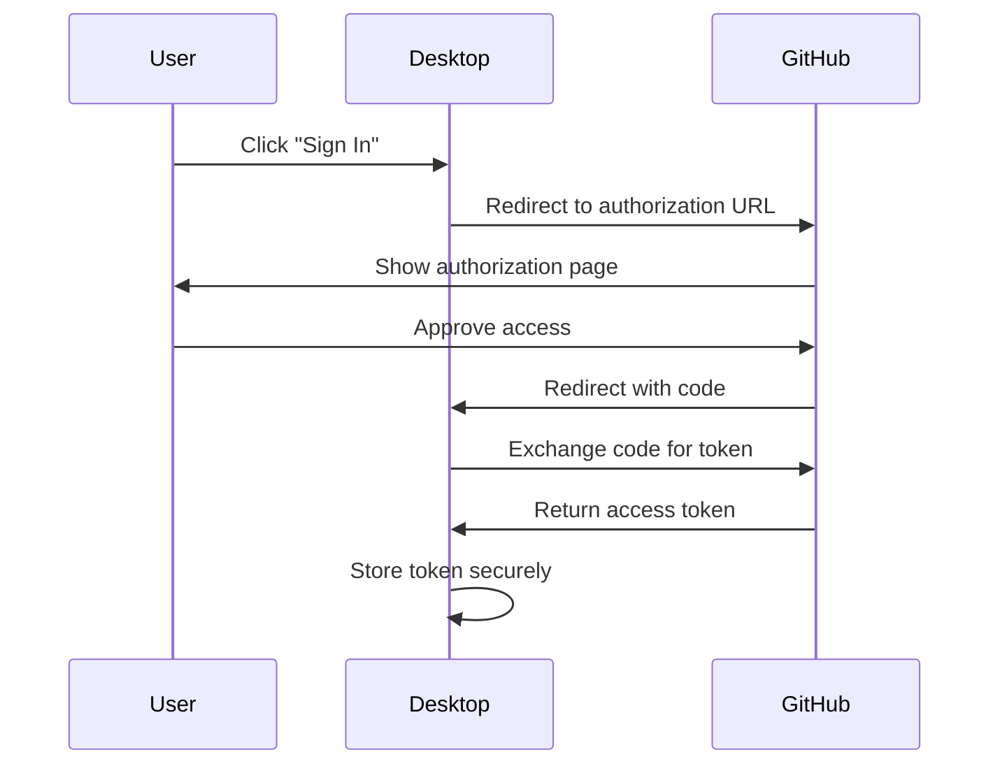

## Overview

GitHub Desktop uses [OAuth web application flow](https://developer.github.com/v3/oauth/#web-application-flow) to interact with the GitHub API and perform actions on behalf of users. The application is bundled with OAuth credentials (Client ID and Secret) for authentication.

## Developer OAuth Application

### Default Credentials

For external contributors and development builds, GitHub Desktop includes a developer OAuth application to enable local testing without configuration.

<Warning>
**DO NOT TRUST THESE CREDENTIALS IN PRODUCTION!** The bundled credentials are only for testing purposes.
</Warning>

From `app/app-info.ts:5`:

```typescript
const devClientId = '3a723b10ac5575cc5bb9'
const devClientSecret = '22c34d87789a365981ed921352a7b9a8c3f69d54'

export function getReplacements() {
  const isDevBuild = channel === 'development'

  return {
    __OAUTH_CLIENT_ID__: s(process.env.DESKTOP_OAUTH_CLIENT_ID || devClientId),
    __OAUTH_SECRET__: s(
      process.env.DESKTOP_OAUTH_CLIENT_SECRET || devClientSecret
    ),
    __DARWIN__: process.platform === 'darwin',
    __WIN32__: process.platform === 'win32',
    __LINUX__: process.platform === 'linux',
    // ... other replacements
  }
}
```

### Limitations

<Note>
The developer OAuth application **will not work with GitHub Enterprise**. Sign-in will fail on the OAuth callback due to missing credentials.
</Note>

## Custom OAuth Credentials

### Environment Variables

To use your own OAuth application, set these environment variables before building:

```bash
export DESKTOP_OAUTH_CLIENT_ID="your_client_id"
export DESKTOP_OAUTH_CLIENT_SECRET="your_client_secret"
```

### Build-Time Injection

OAuth credentials are bundled into the application during the webpack build process. The environment variables are read and replaced in the source code at build time.

<Steps>
  <Step title="Create GitHub OAuth App">
    Register a new OAuth application at [GitHub Developer Settings](https://github.com/settings/developers).
  </Step>
  
  <Step title="Set environment variables">
    Export `DESKTOP_OAUTH_CLIENT_ID` and `DESKTOP_OAUTH_CLIENT_SECRET` in your shell.
  </Step>
  
  <Step title="Build the application">
    Run the build process - webpack will inject your credentials.
  </Step>
</Steps>

## Authentication Flow

### OAuth Web Application Flow

GitHub Desktop implements the standard OAuth 2.0 authorization code flow:



### Authorization Request

The desktop application initiates OAuth by redirecting to GitHub's authorization endpoint:

```
https://github.com/login/oauth/authorize?
  client_id=YOUR_CLIENT_ID&
  scope=repo,user,workflow&
  state=RANDOM_STATE
```

### Token Exchange

After user approval, GitHub redirects back with an authorization code. Desktop exchanges this for an access token:

```typescript
POST https://github.com/login/oauth/access_token

{
  client_id: CLIENT_ID,
  client_secret: CLIENT_SECRET,
  code: AUTHORIZATION_CODE
}
```

## Credential Storage

### Keychain Integration

GitHub Desktop stores OAuth tokens securely using the operating system's credential manager:

- **macOS**: Keychain
- **Windows**: Credential Manager
- **Linux**: libsecret

### Auth Key Generation

From `app/src/lib/auth.ts:4`:

```typescript
/** Get the auth key for the user. */
export function getKeyForAccount(account: Account): string {
  return getKeyForEndpoint(account.endpoint)
}

/** Get the auth key for the endpoint. */
export function getKeyForEndpoint(endpoint: string): string {
  const appName = __DEV__ ? 'GitHub Desktop Dev' : 'GitHub'

  return `${appName} - ${endpoint}`
}
```

<Info>
Development and production builds use different keychain keys to prevent conflicts when running both versions.
</Info>

## GitHub Enterprise Support

### Production Credentials Required

To support GitHub Enterprise authentication:

<Steps>
  <Step title="Obtain OAuth credentials">
    Get a Client ID and Secret from your GitHub Enterprise instance.
  </Step>
  
  <Step title="Configure environment">
    Set the environment variables with your Enterprise OAuth app credentials.
  </Step>
  
  <Step title="Build custom version">
    Create a custom build with your credentials embedded.
  </Step>
</Steps>

### Multiple Accounts

Desktop supports multiple accounts across different endpoints:

- GitHub.com accounts
- GitHub Enterprise Server accounts
- Multiple Enterprise instances

Each account is stored with a unique key based on the endpoint URL.

## Security Considerations

### Client Secret Protection

<Warning>
While the OAuth Client Secret is bundled in the application, it's not meant to remain truly secret in desktop applications. This is a known limitation of OAuth for native apps.
</Warning>

### Best Practices

<Steps>
  <Step title="Use HTTPS">
    Always use HTTPS for OAuth callbacks and token exchange.
  </Step>
  
  <Step title="Validate state parameter">
    Implement CSRF protection using the state parameter.
  </Step>
  
  <Step title="Limit scopes">
    Only request the minimum required OAuth scopes.
  </Step>
  
  <Step title="Rotate credentials">
    Periodically rotate OAuth application credentials in production.
  </Step>
</Steps>

### Required Scopes

GitHub Desktop requires these OAuth scopes:

- `repo` - Full control of private repositories
- `user` - Read/write access to profile info
- `workflow` - Update GitHub Action workflows

## Token Management

### Token Refresh

GitHub OAuth tokens do not expire but can be revoked by:

- User revoking access in GitHub settings
- OAuth app deletion
- Enterprise policy changes

### Handling Revoked Tokens

When API requests fail with authentication errors:

<Steps>
  <Step title="Detect 401 response">
    Monitor API responses for authentication failures.
  </Step>
  
  <Step title="Clear stored token">
    Remove the invalid token from the credential store.
  </Step>
  
  <Step title="Prompt re-authentication">
    Show sign-in dialog to the user.
  </Step>
</Steps>

## Development Workflow

### Using Default Credentials

For local development and testing:

```bash
# No environment variables needed
npm start
```

The default developer credentials will be used automatically.

### Testing with Custom Credentials

```bash
# Set your OAuth app credentials
export DESKTOP_OAUTH_CLIENT_ID="your_client_id"
export DESKTOP_OAUTH_CLIENT_SECRET="your_client_secret"

# Build and run
npm run build
npm start
```

### Verifying Credentials

Check which credentials are bundled:

```typescript
// In development console
console.log(__OAUTH_CLIENT_ID__)
console.log(__DEV_SECRETS__)  // true if using dev credentials
```

## Debugging Authentication

### Common Issues

**Sign-in fails with Enterprise**
- Verify custom OAuth credentials are set
- Check Enterprise instance URL is correct
- Ensure OAuth app is registered on Enterprise instance

**Token not persisting**
- Check keychain/credential manager permissions
- Verify app has access to secure storage
- Test with different endpoint key

**Callback URL mismatch**
- Ensure OAuth app callback URL matches Desktop's expected URL
- Check for HTTPS requirement

### Enable Debug Logging

```bash
# Set debug environment variable
export DEBUG="desktop:*"
npm start
```

## API Integration

### Using OAuth Token

Once authenticated, the token is included in all GitHub API requests:

```typescript
const headers = {
  'Authorization': `token ${oauthToken}`,
  'Accept': 'application/vnd.github.v3+json'
}

fetch('https://api.github.com/user', { headers })
```

### Rate Limiting

Authenticated requests have higher rate limits:

- **Authenticated**: 5,000 requests per hour
- **Unauthenticated**: 60 requests per hour

<Info>
GitHub Enterprise instances may have different rate limits configured by administrators.
</Info>