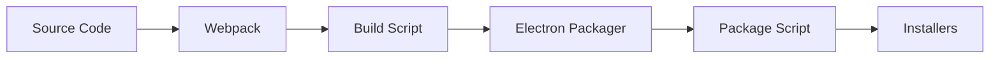

## Overview

GitHub Desktop uses a multi-stage build pipeline combining webpack, electron-packager, and platform-specific packaging tools. This document outlines the build process for all supported platforms.

## Build Pipeline



## Webpack Configuration

### Configuration Files

GitHub Desktop uses webpack to transpile and bundle application resources. Configuration files are located in `app/`:

- `app/webpack.common.ts` - Base configuration and shared settings
- `app/webpack.development.ts` - Development mode overrides
- `app/webpack.production.ts` - Production mode optimizations

### Build Targets

Webpack organizes source files into these output targets:

| Target | Purpose |
|--------|--------|
| `main.js` | Main process logic (Electron) |
| `renderer.js` | Renderer process logic (UI) |
| `crash.js` | Crash reporter UI |
| `highlighter.js` | Syntax highlighting (Web Worker) |
| `cli.js` | Command-line interface |

### Build-Time Replacements

Webpack replaces platform-specific placeholders during compilation:

```typescript
// From app/app-info.ts
export function getReplacements() {
  return {
    __OAUTH_CLIENT_ID__: s(process.env.DESKTOP_OAUTH_CLIENT_ID || devClientId),
    __OAUTH_SECRET__: s(process.env.DESKTOP_OAUTH_CLIENT_SECRET || devClientSecret),
    __DARWIN__: process.platform === 'darwin',
    __WIN32__: process.platform === 'win32',
    __LINUX__: process.platform === 'linux',
    __APP_NAME__: s(productName),
    __APP_VERSION__: s(version),
    __DEV__: isDevBuild,
    __RELEASE_CHANNEL__: s(channel),
    __UPDATES_URL__: s(getUpdatesURL()),
    __SHA__: s(getSHA()),
  }
}
```

### Additional Processing

<Steps>
  <Step title="SCSS compilation">
    Stylesheets under `app/styles/` are transpiled to CSS and emitted.
  </Step>
  
  <Step title="Source map generation">
    Source maps correlate runtime errors to TypeScript source.
  </Step>
  
  <Step title="Output to /out">
    Compiled assets are written to the `out/` directory (ignored in git).
  </Step>
</Steps>

## Version Management

### Canonical Version

The version number displayed in **About GitHub Desktop** comes from:

```json
// app/package.json
{
  "version": "3.3.0"
}
```

<Info>
This `version` attribute in `app/package.json` is the single source of truth for the application version.
</Info>

### Changelog

The `changelog.json` file tracks user-facing changes:

- New features
- Bug fixes
- Improvements
- Removed features

## Build Script

### script/build.ts

After webpack compilation, `script/build.ts` handles:

<Steps>
  <Step title="Resource merging">
    Moves additional static resources into the output directory.
  </Step>
  
  <Step title="License generation">
    Creates a license bundle from project dependencies, accessible from **About GitHub Desktop**.
  </Step>
  
  <Step title="License metadata">
    Generates license metadata from choosealicense.com for the "Add license" feature.
  </Step>
  
  <Step title="Electron packaging">
    Launches electron-packager to merge app resources with Electron runtime.
  </Step>
</Steps>

### Code Signing (macOS)

`electron-packager` performs code-signing on macOS during the build stage.

<Warning>
Without code-signing configured, you'll see this warning:

```
Packaging app for platform darwin x64 using electron v2.0.9
WARNING: Code sign failed; please retry manually. 
Error: No identity found for signing.
```

This is acceptable for development but required for distribution.
</Warning>

## Package Script

### Platform-Specific Packaging

From `script/package.ts:38`:

```typescript
const distPath = getDistPath()
const productName = getProductName()
const outputDir = getDistRoot()

if (process.platform === 'darwin') {
  packageOSX()
} else if (process.platform === 'win32') {
  packageWindows()
} else {
  console.error(`I don't know how to package for ${process.platform} :(`) 
  process.exit(1)
}
```

## macOS Packaging

### Archive Creation

From `script/package.ts:53`:

```typescript
function packageOSX() {
  const dest = getOSXZipPath()
  rmSync(dest, { recursive: true, force: true })

  console.log('Packaging for macOS…')
  cp.execSync(
    `ditto -ck --keepParent "${distPath}/${productName}.app" "${dest}"`
  )
}
```

<Steps>
  <Step title="Application bundle ready">
    The previous build step created a signed `.app` bundle.
  </Step>
  
  <Step title="Compress to ZIP">
    The app is compressed using `ditto`, reducing download size by ~60%.
  </Step>
  
  <Step title="Ready for distribution">
    No additional packaging needed for macOS.
  </Step>
</Steps>

## Windows Packaging

### Dual Installer Strategy

Desktop uses `electron-winstaller` to generate two installers:

<Info>
**Squirrel Installer** - User-level installation without elevated permissions

**Windows Installer (MSI)** - Administrator-level installation for enterprise deployment
</Info>

From `script/package.ts:63`:

```typescript
function packageWindows() {
  const iconSource = join(getIconDirectory(), 'icon-logo.ico')
  const splashScreenPath = path.resolve(
    __dirname,
    '../app/static/logos/win32-installer-splash.gif'
  )

  const nugetPkgName = getWindowsIdentifierName()
  const options: electronInstaller.Options = {
    name: nugetPkgName,
    appDirectory: distPath,
    outputDirectory: outputDir,
    authors: getCompanyName(),
    iconUrl: 'https://desktop.githubusercontent.com/app-icon.ico',
    setupIcon: iconSource,
    loadingGif: splashScreenPath,
    exe: `${nugetPkgName}.exe`,
    title: productName,
    setupExe: getWindowsStandaloneName(),
    setupMsi: getWindowsInstallerName(),
  }

  electronInstaller.createWindowsInstaller(options)
}
```

### Installation Targets

**Squirrel Installer (.exe)**
- Installs to `%LOCALAPPDATA%`
- No administrator rights required
- Automatic updates supported
- Preferred for individual users

**Windows Installer (.msi)**
- Can be deployed by administrators
- Still uses `%LOCALAPPDATA%` when users run the app
- See [#1086](https://github.com/desktop/desktop/issues/1086) for ongoing discussion

### Code Signing (Windows)

From `script/package.ts:108`:

```typescript
if (isGitHubActions() && isPublishable()) {
  assertNonNullable(process.env.RUNNER_TEMP, 'Missing RUNNER_TEMP env var')

  const acsPath = join(process.env.RUNNER_TEMP, 'acs')
  const dlibPath = join(acsPath, 'bin', 'x64', 'Azure.CodeSigning.Dlib.dll')

  const acsMetadata = {
    Endpoint: 'https://wus3.codesigning.azure.net/',
    CodeSigningAccountName: 'GitHubInc',
    CertificateProfileName: 'GitHubInc',
    CorrelationId: `${process.env.GITHUB_SERVER_URL}/${process.env.GITHUB_REPOSITORY}/actions/runs/${process.env.GITHUB_RUN_ID}`,
  }

  options.signWithParams = `/v /fd SHA256 /tr "http://timestamp.acs.microsoft.com" /td SHA256 /dlib "${dlibPath}" /dmdf "${metadataPath}"`
}
```

`electron-winstaller` handles installer code-signing during the packaging process.

### Delta Packages

<Info>
Squirrel supports delta packages representing differences between versions, reducing update download sizes.
</Info>

From `script/package.ts:100`:

```typescript
if (shouldMakeDelta()) {
  const url = new URL(getUpdatesURL())
  // Bypass staggered release for delta generation
  url.searchParams.set('bypassStaggeredRelease', '1')
  options.remoteReleases = url.toString()
}
```

Delta package generation:
- Downloads the previous version
- Computes binary diff
- Creates smaller update packages
- Only unchanged bytes are downloaded

### NuGet Package Renaming

From `script/package.ts:132`:

```typescript
// electron-winstaller doesn't let us control nuget package names
// so we rename them to include architecture
const arch = getDistArchitecture()
const prefix = `${getWindowsIdentifierName()}-${getVersion()}`

for (const kind of shouldMakeDelta() ? ['full', 'delta'] : ['full']) {
  const from = join(outputDir, `${prefix}-${kind}.nupkg`)
  const to = join(outputDir, `${prefix}-${arch}-${kind}.nupkg`)

  console.log(`Renaming ${from} to ${to}`)
  await rename(from, to)
}
```

## Linux Packaging

<Note>
Linux packaging is maintained in the [`shiftkey/desktop`](https://github.com/shiftkey/desktop) fork.

Refer to that repository for:
- `.deb` package creation
- `.rpm` package creation  
- AppImage distribution
- Snap packaging
</Note>

## Publishing

### script/publish.ts

The publish script:

<Steps>
  <Step title="Upload artifacts">
    Uploads packaging artifacts to S3 bucket.
  </Step>
  
  <Step title="Verification">
    Artifacts are verified before release.
  </Step>
  
  <Step title="Distribution">
    Build is made available to users after verification.
  </Step>
</Steps>

## Bundle Size Tracking

From `script/package.ts:47`:

```typescript
console.log('Writing bundle size info…')
writeFileSync(
  path.join(getDistRoot(), 'bundle-size.json'),
  JSON.stringify(getBundleSizes())
)
```

Bundle sizes are tracked to monitor application bloat.

## Development Commands

### Build for Development

```bash
npm run build:dev
```

Uses `webpack.development.ts` configuration:
- Source maps enabled
- No minification
- Fast build times

### Build for Production

```bash
npm run build:prod
```

Uses `webpack.production.ts` configuration:
- Minification enabled
- Optimized bundle sizes
- Production replacements

### Package Application

```bash
npm run package
```

Runs the complete packaging pipeline:
1. Clean output directory
2. Run webpack build
3. Execute build script
4. Run package script

## Troubleshooting

### Build Failures

**Missing dependencies**
```bash
rm -rf node_modules
npm install
```

**Stale webpack cache**
```bash
rm -rf out/
npm run build:dev
```

### Code Signing Issues

**macOS: No identity found**
- Install valid Apple Developer certificate
- Verify in Keychain Access
- Set `CSC_NAME` environment variable

**Windows: Signing failed**
- Check Azure Code Signing configuration
- Verify certificate is valid
- Ensure proper permissions in CI/CD

### Package Errors

**electron-packager fails**
- Check Electron version compatibility
- Verify all dependencies are installed
- Ensure output directory is writable

**electron-winstaller fails**
- Check icon file exists and is valid .ico
- Verify splash screen GIF is present
- Ensure sufficient disk space